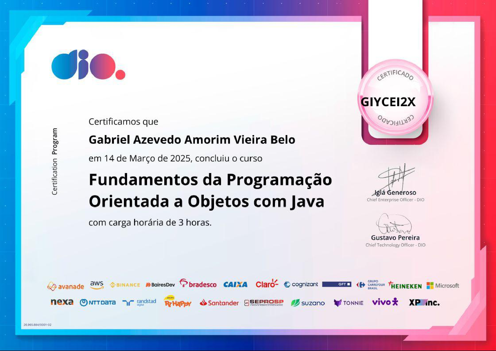

## Java - POO

Curso de Programação Orientada a Objetos
> Seção: Fundamentos da Programação Orientada a Objetos com Java

## Descrição

Abordar os conceitos do paradigma e os pilares da orientação a objetos, classes, enums, construtores, *Java Bens* e UML.

## Conteúdo

> Clique no assunto para acessar
- [`Conceito de POO`](src/edu/gabriel/conceitoPOO/README.md)
- [`Classes`](src/edu/gabriel/conceitosClasses/README.md)
- [`Pacotes`](src/edu/gabriel/pacotes/README.md)
- [`Visibilidade de recursos`](src/edu/gabriel/visibilidaderecursos/README.md)
- [`Getters e Setters`](src/edu/gabriel/gettersesetters/README.md)
- [`Construtores`](src/edu/gabriel/construtores/README.md)
- [`Enums`](src/edu/gabriel/classesenums/README.md)
- [`UML`](src/edu/gabriel/UML/README.md)

## Certificação

