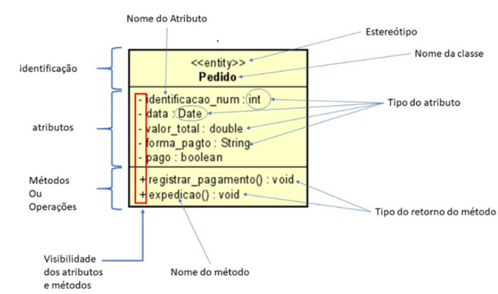

## UML

Linguagem de Modelagem Unificada (*UML*) é uma notação que possibilita a representação gráfica do projeto.

> Na *UML* temos três conceitos necessários para compreendermos inicialmente:

- **Diagramas**, **Elementos** e **Relacionamentos**.

As notações UML são distribuídas em duas categorias de diagramas, a estrutural e comportamental, conforme a listagem abaixo:

### Diagramas estruturas

- **Diagrama de classe**: Este diagrama é utilizado para fazer a representação de estruturas de classes de negócio, interfaces e outros componentes do sistema, Por esta característica, este diagrama é considerado o mais importante para a UML< pois auxilia a maioria dos demais diagramas.

- **Diagrama de objetos**: Este diagrama representa os objetos existentes em um determinado instante ou fato na aplicação. Assim conseguimos ter uma perspectiva do estado de nossos objetos mediante a interação dos usuários no sistema.

> Existem outras categorias de diagramas estruturas e comportamentais.

#### Diagrama de classe

O diagrama de classes ilustra graficamente como classes que serão estruturadas e interligadas entre si diante da proposta do nosso software.

> Em um diagrama a estrutura das classes é constituída por:

- **Identificação**: Nome e/ou finalidade da classe.
- **Atributos**: Propriedades e/ou características.
- **Operações**: Ações e/ou métodos.

- **Relacionamentos**: Em um diagrama as classes podem existir de forma independente, mas obviamente haverá em alguma etapa da aplicação a necessidade de algumas se relacionarem, o que devemos compreender é o nível de dependência entre elas:

    - *Associação*: Uma associação define um relacionamento entre duas classes, permitindo que um objeto tenha acesso a estrutura de um outro objeto.

    - *Agregação*: Em uma agregação a classe principal contém uma relação com outra classe mas ela pode existir sem a classe agregados. Imagina eum um cadastro de Candidatos, podemos encontrar candidatos que ainda não possuam uma Profissão.

    - *Composição*: Caracteriza uma dependência existencial entre a classe principal e a classe associada. Imaginamis que uma Admissão só poderá existir contendo suas informações básicas e a composição do Candidato selecionado.
    
        

- **Multiplicidade**: Nem sempre o relacionamento entre as classes será de **um para um**, em determinados cenários podem existir *multiplicidades* específicas conforme opções abaixo:

    - `1.` -> Representa uma associação **contendo um elemento**.
    - `*.` -> Representa uma associação **contendo uma lista de elementos**.
    - `0..1` -> Representa uma associação **contendo zero ou um elemento**.
    - `0..*` -> Representa uma associação **contendo zero ou uma lista de elementos**.
    - `1..*` -> Representa uma associação **contendo um ou uma lista de elementos**.

- **Visibilidade**: Os atributos e métodos de uma classe podem receber níveis de visibilidade, e na UML existem símbolos que representam cada um deles.

    - `(+)` Visibilidade pública
    - `(#)` Visibilidade protegida (associada a heranças)
    - `(-)` Visibilidade privada

    > Exemplo:

    