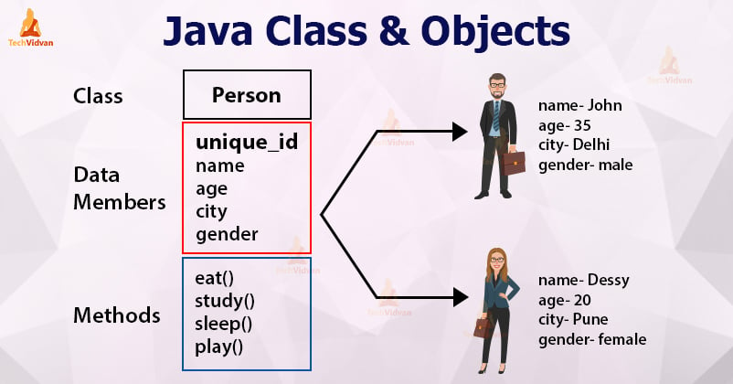

## Classes

Toda estrutura de código em Java é distribuído em arquivos com extensão `.java` denominados de `classe`.

As classes existentes em noso projeto serão compostas por:

> **Identificador, Características e Comportamentos**

- **Classe** (*class*): A estrutura e ou representação que direciona a criação dos objetos de mesmo tipo.
- **Identificador** (*identity*): Propósito existencial aos objetos que serão criados.
- **Características** (*states*): Também conhecido como `atributos` ou `propriedades`, é toda informação que representa o estado do objeto.
- **Comportamentos** (*behavior*): Também conhecido como `ações` ou `métodos`, é toda parte comportamental que um objeto dispõe.
- **Instanciar** (*new*): É o ato de criar um objeto a partir de estrutura definida em uma classe.

> Exemplo:



- Para ilustrar essas etapas de orientação a objeto em Java, vamos reproduzir a imagem em código para explicar que primeiro criamos a estrutura (`classe`) correspondente para assim criarmos as pessoas (`objetos`) com as características e possibilidade de realização de ações (*behavior*) como se fosse no "mundo real".

> Criando a *classe*
```
public class Student {
    String name;
    int age;
    Color color;
    Sex sex;

    void eating(Food food){
        //codigo acao
    }

    void drinking(Eat eat){
        // codigo acao
    }
}
```

> Criando os *objetos*
```

```
