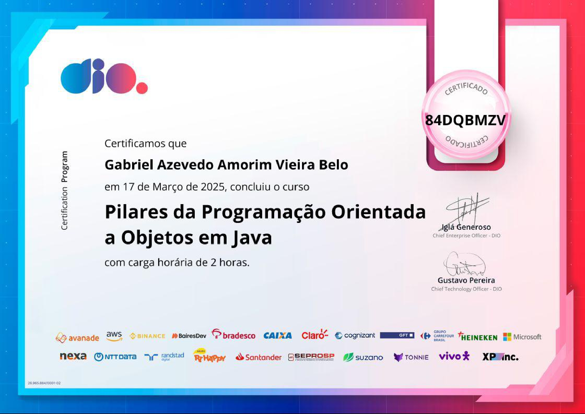

## Java - POO

Curso de Programação Orientada a Objetos
> Seção: Pilares da Programação Orientada a Objetos em Java

## Descrição

Abordar os conceitos do paradigma e os pilares da orientação a objetos, classes, enums, construtores, *Java Bens* e UML.

## Conteúdo

> Clique no assunto para acessar
- [`Pilares do POO`](src/edu/gabriel/pilarespoo/README.md)
- [`Encapsulamento`](src/edu/gabriel/encapsulamento/README.md)
- [`Herança`](src/edu/gabriel/heranca/README.md)
- [`Abstração`](src/edu/gabriel/abstracao/README.md)
- [`Polimorfismo`](src/edu/gabriel/polimorfismo/README.md)
- [`Interface`](src/edu/gabriel/interfaceconceito/README.md)

## Certificação

